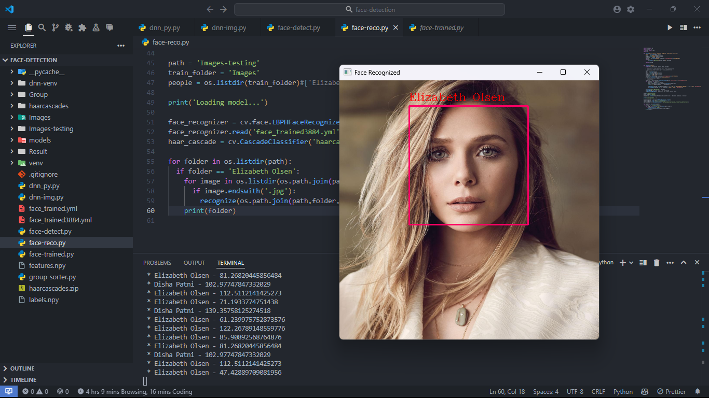
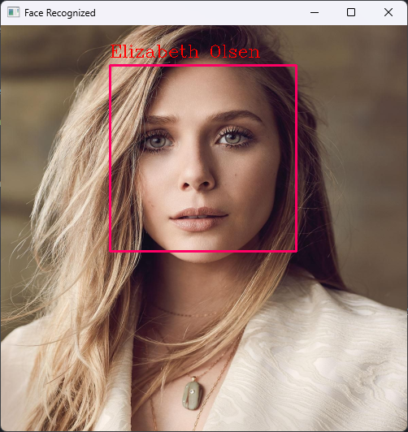
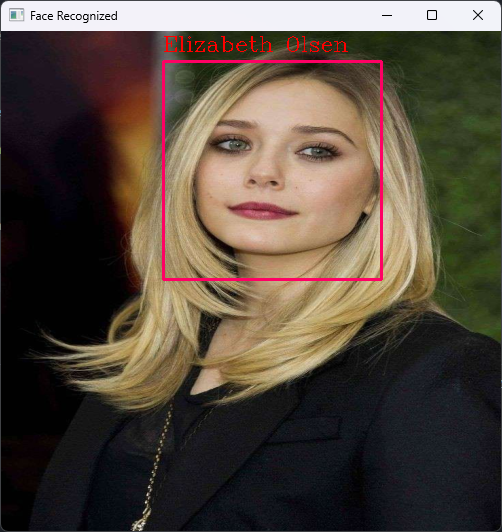

# Face Detection and Recognition

## Description

This project is designed to detect and recognize faces of different people using the Haarcascade model. It utilizes OpenCV for image processing and face detection. The program can identify and label faces in real-time from a video feed or static images.

## Installation

To install the required dependencies, run the following command:

```bash
pip install -r requirements.txt
```

To start the program, run the following command:

```bash
python face-reco.py
```

## Sample



## Confidence for the result

### Example 1: Confidence

#### * Elizabeth Olsen - 73.20118689636342



### Example 2: Confidence

#### * Elizabeth Olsen - 85.90892568764876


